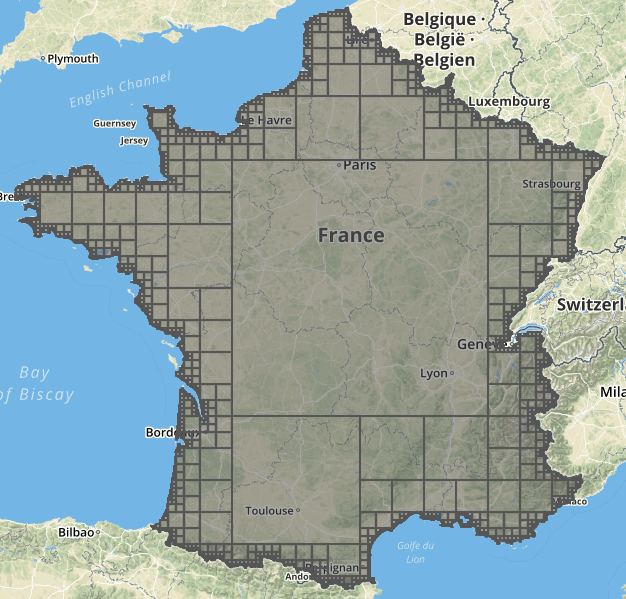

# tiles-calculator

> a node.js script for calculate minimum spatial extent tiles in a perimeter

use [`tilebelt`](https://github.com/mapbox/tilebelt) and [`turf`](https://github.com/Turfjs/turf) modules

### Usage :

`node index.js > result.geojson`

### ToDo :

- [ ] using parameters
- [ ] use as executable
- [ ] store tiles as list
